# Module 1: Basics of Digital Signal Processing

## 1.1 Introduction to Digital Signal Processing

**What is a signal ?**

---

It is a **description of the evolution of a physical phenomenon**.

* weather $\longrightarrow$ temperature

* sound $\longrightarrow$ pressure

* sound $\longrightarrow$ magnetic deviation

* light intensity $\longrightarrow$ gray level on paper

  

So, we have a signal then we have the processing part. And the processing part is where we make sense of this information that has been described by the signal. We can process the signal in two ways. 

* **Analysis:** We can analyze it, namely we want to understand the information carried by the signal and perhaps extract some more high level description. 

* **Synthesis:** Or we can synthesize a signal, that's also signal processing. And that's when we create a physical phenomenon that contains a certain amount of information, that we want to put out in the world. And this is really what we do when we transmit information, like when we use our cell phone or the radio, or when we generate sounds with a music synthesizer.

### Analog vs Digital signals : 

**Analog:**

---

Now if I show you a wave form like this, you probably have seen this before and you can guess that it is some sort of representation of a sound or speech. 

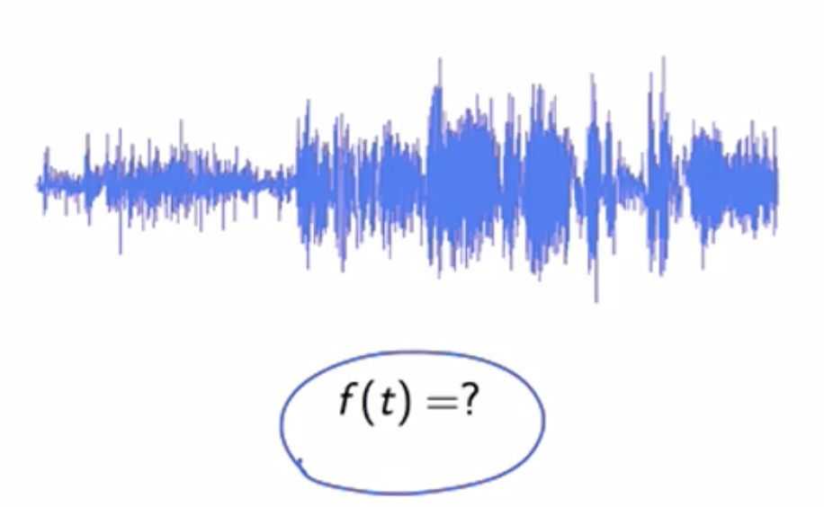

And if we were to apply this mathematical model to this kind of information. The question is, what is the function that describes the sound? Well there's no really an easy answer for that. What I can try to do is record this information, and people have invented extremely sophisticated devices to do so. So for sound, for instance, I could come up with a record player, I could come up with a tape recorder, and then if I want to measure a temperature signal then I would have to come up with a mechanical system that drags a pencil on a piece of paper to record the evolution of temperature. And to capture photographs, I will have to invent a camera. But you see every device is specific to a certain signal. It will record any information but it will not let me manipulate this nformation easily and in a generic way. In other words, the recording device will give me something like a picture, something like this. 

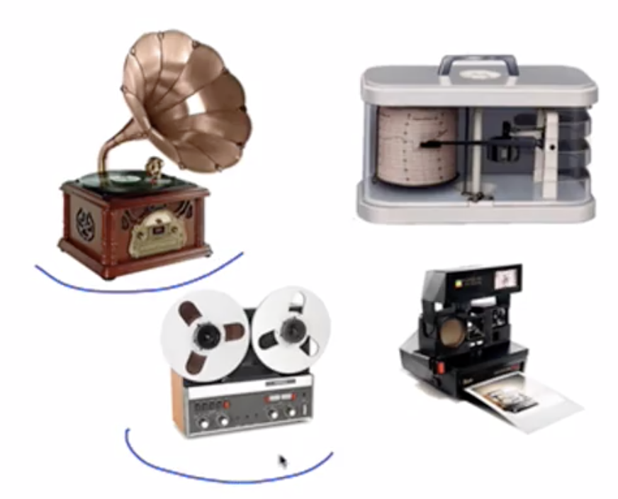

But it will not answer the question, what is the function that describes the phenomenon? This is the problem with analogue signals. Mathematically we will formalise with the following mapping:
$$
f : \mathbb{R} \rightarrow \mathbb{V}
$$

**Digital:**

-----

The big paradigm shift and the power inherent to digital signal processing, is that we're moving away from an analog model for signals like this. So we're not asking, what is the function that represents the signal anymore, we're just moving to a recording of the values of this function. And represent the phenomenon just as a series of numbers. And in particular, for digital signals, these numbers are integers. The so called digital paradigm is composed of two fundamental ingredients:

* Discrete time
* Discrete amplitude

We will formalize with the following mapping:
$$
\mathbb{x} : \mathbb{Z} \rightarrow \mathbb{V}
$$
We will denote a discrete time signal by:
$$
\mathbb{x}[n] = ~..., 1.2390, -0.7372, 0.8987, 0.1798, -1.1501, -0.2642, ...
$$

**We will pretty soon see that $n$ does not have a physical dimension.** It's just an ordinal number that orders the samples one after the other.

**Sampling Theory:**

---

**Are we loosing information using a discrete time sequence ?** The question is a fundamental importance and the answer was given to use at the beginning of last century by Harry Nyquist and Claude Shannon. The answer is positive and it states that under very mild conditions, the continuous time representation and the discrete time representation are equivalent. Mathematically, the result is known as a **sampling theorem (1920)**, and it has a very simple statement. The relationship between the continuous time a presentation of a signal, and its discret time counterpart is given by this formula. 
$$
\mathbb{x}(t) = \sum_{n= - \infty}^{+ \infty} \mathbb{x}[n] ~ sinc \Big( \frac{t - n T_s}{T_s} \Big)
$$
The **cardinal sine function** looks like so, with an infinite support function that keeps oscillating from minus infinity to plus infinity:

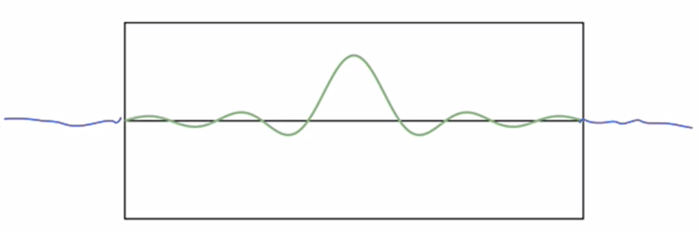

**Continuous to discrete :** And sampling theorem graphically looks like so, you start with a contunous times signal and then you take measurements and then you throw away all the rest

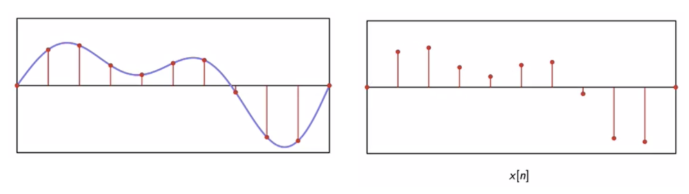

**Discrete to continuous :** to go back to contunous time, all you need to do is take copies of the $sinc(\cdot)$ function and place them at each sample location scaled by the amplitude of the sample. When you sum all these copies of the $sinc( \cdot)$ together, you get back exactly the original function.

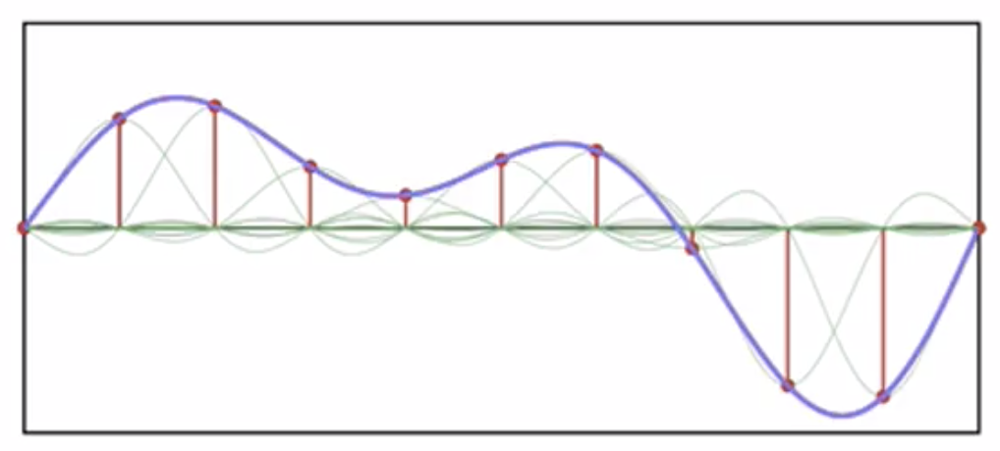

We will have to use the Fourier analysis to do that.

**Discretization of Amplitude :**

---

If our data is just a set of integers it means that its representation is completely abstract and completely general, and this has three important consequences:

* Storage : we won't need a specific storage as we saw for different type of signals, and can be stored as $\{0, 1 \}$
* Processing : with CPUs that are very effective on integers 
* Transmission : we have extremely effective ways to combat noise and maximise the capacity of the communication channel

Let's delve deeper into the Transmission; let's say we have a communication channel, and we try to send information from a transmitter to a receiver,

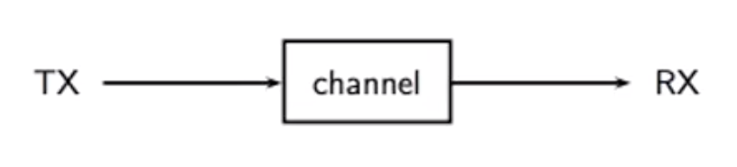

We will face the **fundamental problem of noise**. Inside the channel it will introduce attenuation ($1/G$) and also add noise ($\sigma(t)$).

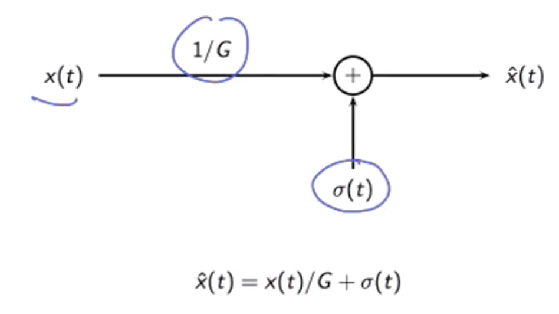

We can see the original signal (on the left) and the one received, an attenuated copy plus noise(on the right):

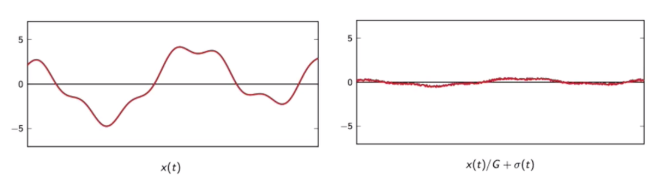

The only thing we can do is adding an amplification at the end of the channel :

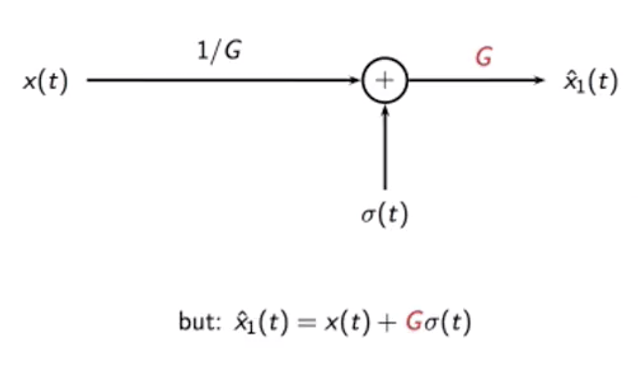

What we get, the Gain factor has also amplified the noise. This is a typical situation that you get in second generation or third generation of say, a tape or if you're trying to do a photocopy of a photocopy.

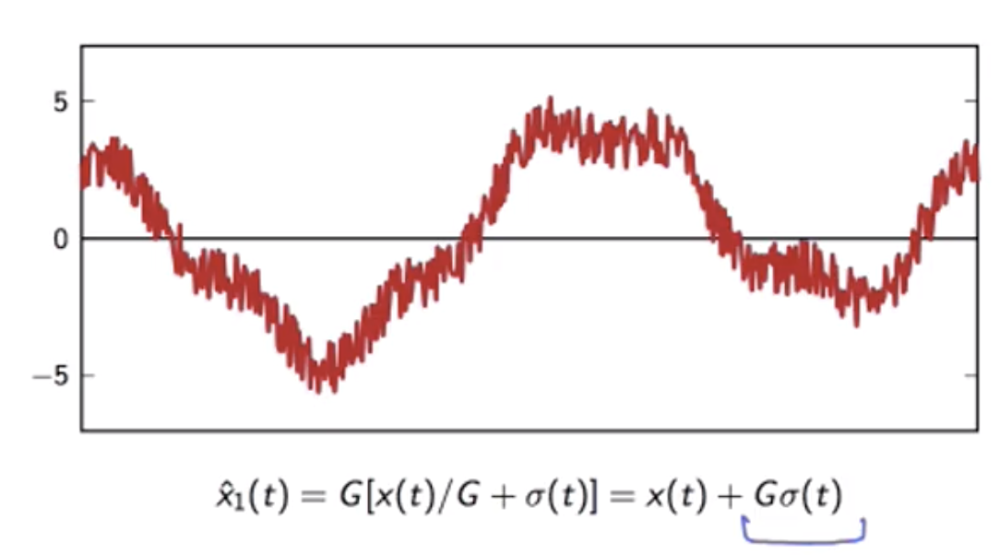

**Practical example - Transmitting a signal overseas**

We split the channel into several chunks and try to undo the attenuation of a chunk in sequence. We put what are called repeater every 10km or so. 

**For an analog signal :** This can lead very quickly to complete loss of intelligibility in a phone conversation.

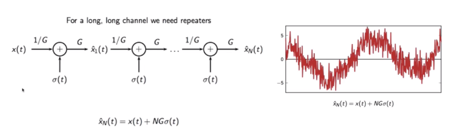

**For a digital signal : **The noise is much larger than before but we can just threshold and say if the signal value is above zero, we just output $5V$ and vice versa. 

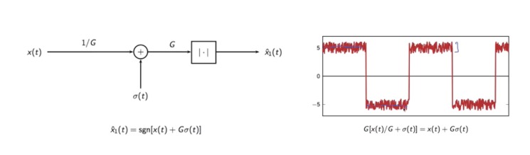

So the thresholding operator will reconstruct a signal like so. So you can seee that at the end of the first repeater, we actually have an exact copy of the transmitted signal and not a noise corrupted copy.

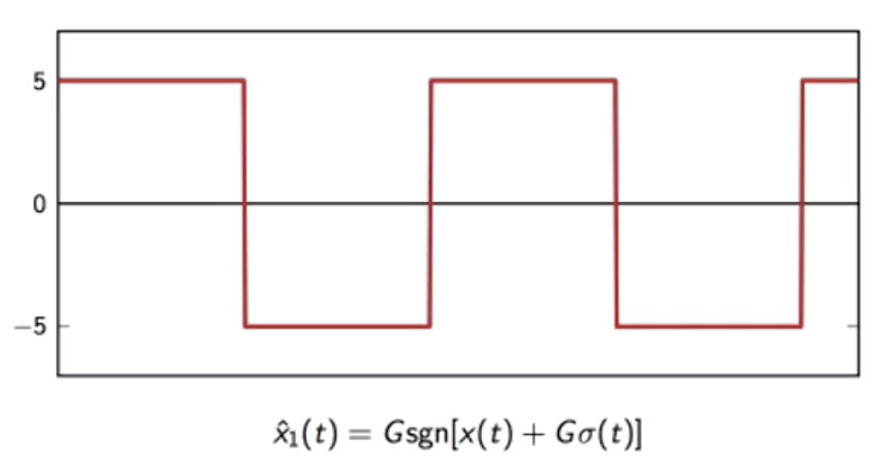

## 1.2 Discrete-time signals

Discrete-time signal: a sequence of **complex** numbers

* one dimension (for now)
* notation: $\mathbb{x}[n]$
* Two-sided sequences: $\mathbb{x}:  \mathbb{Z} \rightarrow \mathbb{C}$
* n is a-dimensional "time" (we do not associate a dimension to it, we can think of it as "time")
* **Analysis:** we create a periodic process where we take periodic measurements of a physical phenomenon (think of the flood of the Nile)
* **Synthesis:** where we use say a computer program to generate data point that simulate a physical phenomenon that we want to reproduce 

**Fundamental Signals:**

---

* The delta signal :

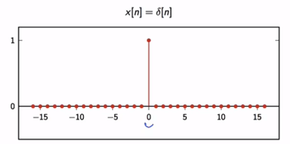

* The unit step :

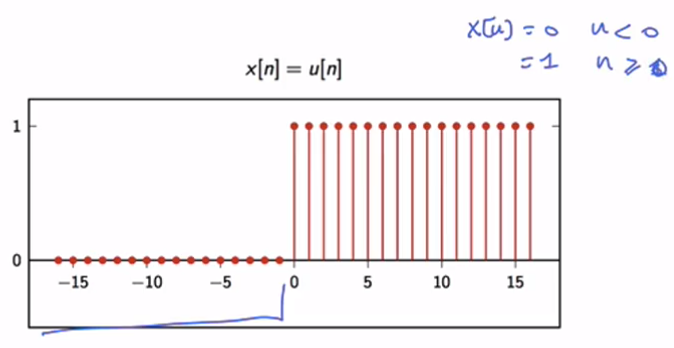

* The exponential decay :

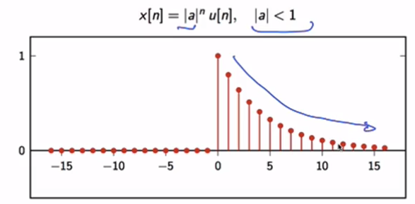

* The sinusoid, $\theta$ is the initial phase

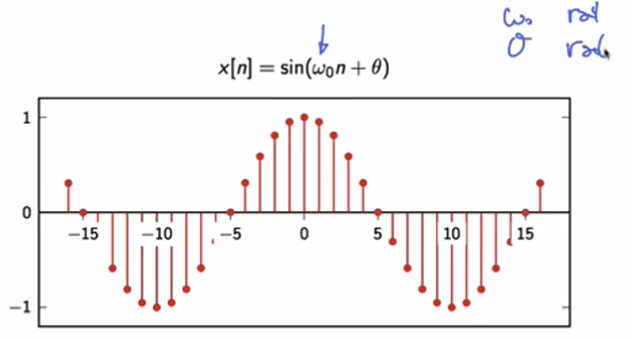

**Division of the discrete-time signals into four classes :**

---

**1. Finite-length signals:** Not practical to develop the entire signal processing theory concentrating only on finite-length signals because the length gets in the way.

* Sequence notation : $\mathbb{x}[n]​$, $n=0,1,...,N-1​$
* Vector notation : $\mathbb{x} = [\mathbb{x}_0 ~ \mathbb{x}_1 ~ ... ~ \mathbb{x}_{N-1}]^T$
* practical entities, good for numerical packages (e.g. numpy)

**2. Infinite-length signals:**

- Sequence notation $\mathbb{x}[n]​$, $n \in \mathbb{Z}​$
- abstraction, good for theorems and results that do not depend on the length of the data

**3. Periodic sequences:**

* $N​$-periodic sequence: $\tilde{ \mathbb{x}}[n] = \tilde{ \mathbb{x}}[n+kN]​$, $n,k,N \in \mathbb{Z}​$
* same information as finite-length of length $N​$
* "natural" bridge between finite and infinite length

**4. Finite support:**

- Finite-support sequence: are infinite length sequences with only a finite number of nonzero samples (we will add the bar on the x symbol), the support is compact

$$
\bar{ \mathbb{x}}[n]=
\left \{
\begin{array}{c @{=} c}
     \mathbb{x}[n] &  if ~0 \le n \le N \\
    0 & otherwise \\
\end{array}
\right.
~~~~ n \in \mathbb{Z}
$$

* same information as finite-length of length N
* it constitutes another bridge between finite and infinite lengths signals. In a way we can always embed a finite-length sequence into an infinite-length sequences either by:
  * periodizing the finite-length sequence, so turning that into a periodic signal
  * by turning it into a finite-support signal by appending 0s before and after the interval

**Elementary operators :**

---

* scaling: $\mathbb{y}[n] = \alpha \mathbb{x}[n]​$ 
* sum: $\mathbb{y}[n] = \mathbb{x}[n] + \mathbb{z}[n]$ 
* product: $\mathbb{y}[n] =\mathbb{x}[n] \cdot \mathbb{z}[n]$ 
* shift by $k​$ (delay) : $\mathbb{y}[n] =\mathbb{x}[n-k]​$ 

**We have two types of shift according to the embedding we choose:**

* We embed the finite-length signal into a **finite-support sequence**

In that case it's as if we were appending and prepending 0s outside of the range of the signal. As we shift we pull in 0s:

 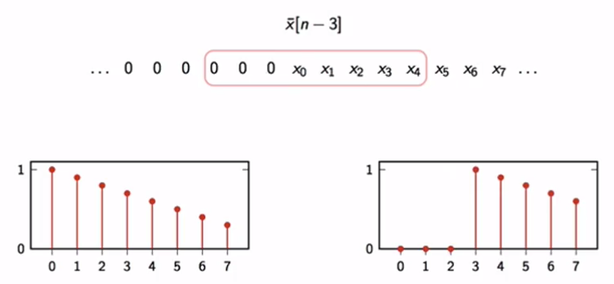

* Shift of a finite-length: **periodic extension**

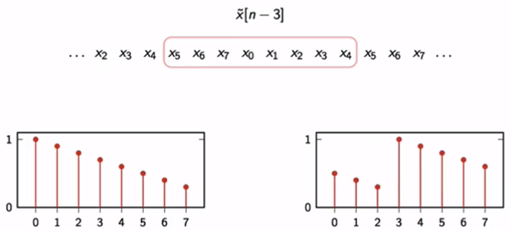

**Energy and power :**

---

Energy:
$$
E_{ \mathbb{x}} = \sum_{n=- \infty}^{+ \infty} | \mathbb{x}[n]|^2
$$
Power : it is the rate of product of energy for a sequence
$$
P_{\mathbb{x}} = \underset{N \rightarrow \infty}{lim} \frac{1}{2N+1} \sum_{n=-N}^{N} | \mathbb{x}[n]|^2
$$
For example, periodic sequences have infinite energy because we are summing the values in one period an infinite number of times. But their power, is equal to the:
$$
E_{\mathbb{x}} = \infty \\
P_{\mathbb{x}}= \frac{1}{N} \sum_{n=0}^{N-1} | \tilde{\mathbb{x}}[n]|^2
$$

## 1.3 Basic signal processing

#### 1.3.1 How your PC plays discrete-time sounds

We will see how to convert from Discrete time to the Physical world:

* **Discrete time:**
  * $n$: no physical dimension (just a counter)
  * periodicity: how many samples before pattern repeats
* **Physical world:**
  * periodicity: how many seconds before pattern repeats
  * frequency measured in Hz ($s^{-1}$)

The PC bridges this gap via a sound card, a device that takes a series of samples, and builds an electric signal that we can feed to a loud speaker. At the heart of this lies a system clock, with a period $T_s$ measured in second. $T_s$ is the time that we wait before we take a new sample from a discrete time sequence, and feed it in the sound card.

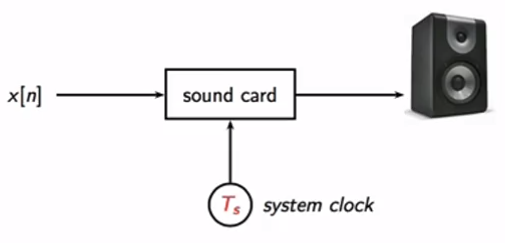

* $T_s$ is the time in seconds between samples
* periodicity of $M$ samples $\longrightarrow$ periodicty of $MT_s$ seconds
* real world frequency:

$$
f = \frac{1}{MT_s} Hz
$$

We denote as well:

* $F_s$ the number of samples per seconds
* $T_s = 1 / F_s$

Example:

A typical value for $F_s = 4800, T_s \approx 20.8 \mu s$. If $M=110$ then $f \approx 440 Hz$

#### 1.3.2 The Karplus-Strong algorithm

We start by defining a Building block: **Arbitrary Delay** and other that I didn't put there (like the sum, multiplication, delay of 1 and so on)

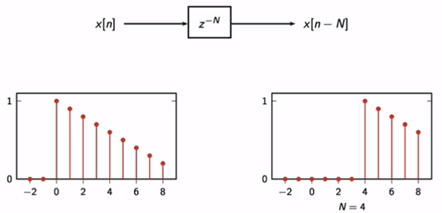

The 2-point Moving Average: take a "local" average, the representation of building block is:
$$
\mathbb{y}[n] = \frac{\mathbb{x}[n] + \mathbb{x}[n-1]}{2}
$$
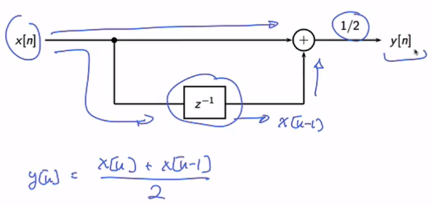

**Examples:**

let's apply it to a delta signal, as we can see nothing really happens before 0; 

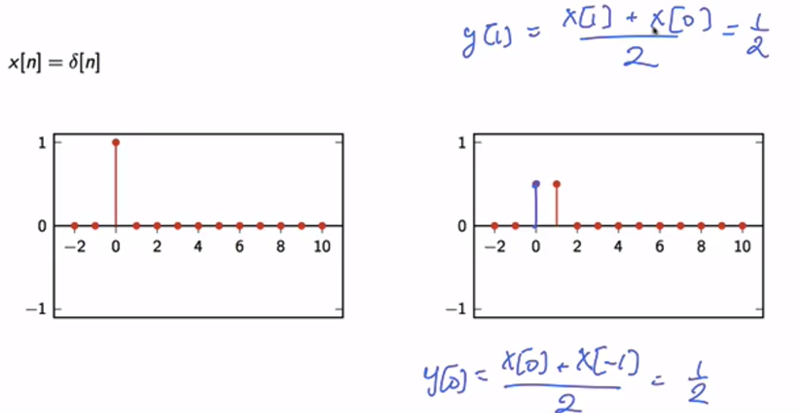

**A recursive algorithm:**

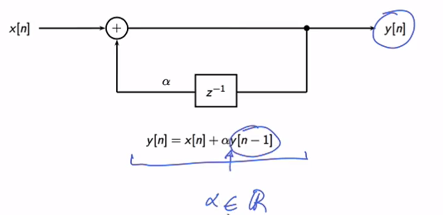

**Example :**

A simple equation to describe compound interest:

* Constant interest / borrowing rate of 5% per year
* Interest accrues on Dec 31
* Deposits/withdrawals during year $n$ :   $\mathbb{x}[n] $ 
* Balance at year n

$$
\mathbb{y}[n] = 1.05 ~ \mathbb{y}[n-1] + \mathbb{x}[n]  
$$

If we draw it as a DSP (Digital Signal Processor) circuit we get:

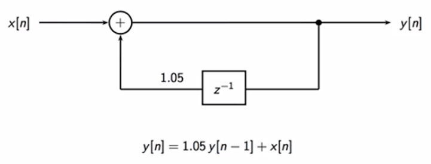

If we do the calculations :

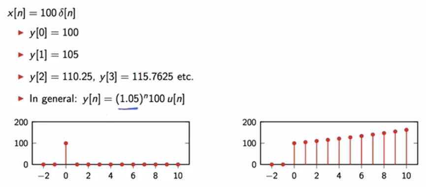

**Creating loops :**

We will add a delay of $M$ which is equivalent to replace it by a cascade of three delayed blocks. So we can use three memory cells and we can use these structure to create loops. We will see how it works by using a delta sequence as the input and $\alpha = 1$ . And the initial condition that all the values are set to zero.

* For $n = 0$ , we give a value to y(0) that goes to z^-1 for for the next n=1, n=2 we will have a zero
* and then for $n=3$ the 1 will leave the memory cells and we will get a 1 again.

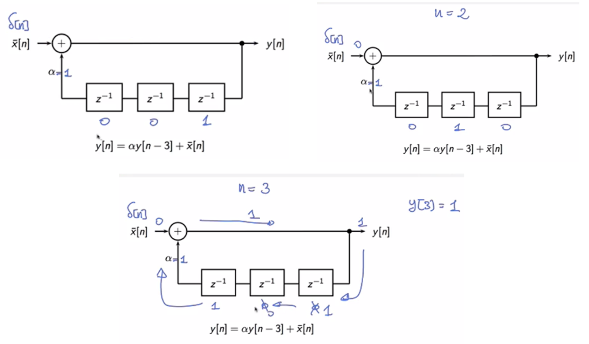

Example:

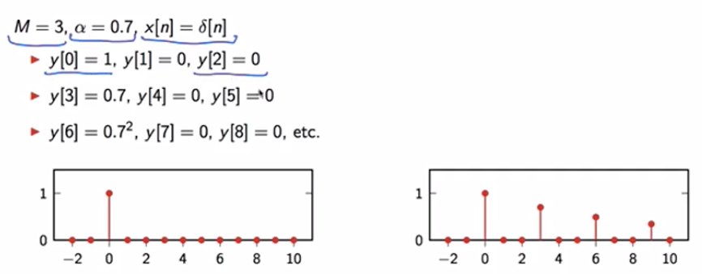

**Introducing some realism :**

-----

* $M​$ controls frequency (pitch)
* $\alpha$ controls envelope (decay)
* $\bar{\mathbb{x}}[n]$ controls color (timbre)

**Karplus Strong algorithm :** This is actually the context in which it was invented by Carplus and Strong and they found out that the best way to initialize the algorithm, so the best way to fill the finite support of the input signal you see is random values compared to a sufficiently fast decay factor. So here we will pick alpha = 0.9. We will use 100 random values between -1 and 1 over the finite support of the input and run the algorithm to obtain a waveform that looks like this. Here you can see the decay factor because we're plotting the signal on a longer window.

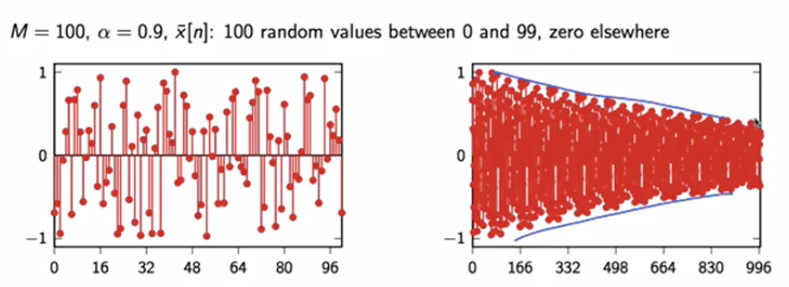

## 1.4 Complex exponentials

#### 

