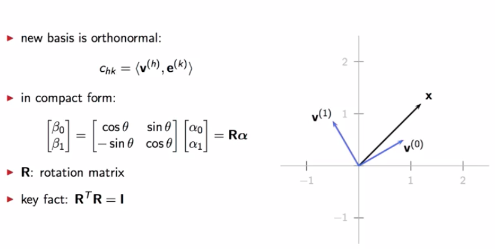

# Module 2: Vector Spaces

## 2.1 Signal processing and vector spaces

We have seen we have four categories of signals:

* finite length
* infinite length
* periodic
* finite support

$\longrightarrow $ We need a common framework: vector space

## 2.2 Vectors spaces

### 2.2.a Vector space

Let's have a look at the inner product in $\mathcal{L}_2[-1,1]$ which is defined as the product of the two functions that corresponds to the two vectors :
$$
\langle \mathbb{x}, \mathbb{y} \rangle = \int_{-1}^{1} \mathbb{x}(t)~ \mathbb{y}(t) dt
$$
**Examples:**

* Computing the norm :

* Calculating the inner product

 

* Calculating the distance: Mean Square Error (MSE)

### 2.2.b Signal spaces

So how are vector spaces going to help up in dealing with discrete time signals ? It should be self-evident by now that finite-length signals live in $\mathbb{C}^N​$. We define the inner product for $\mathbb{C}^N​$ as:
$$
\langle \mathbb{x}, \mathbb{y} \rangle = \sum_{n=0}^{N-1} \mathbb{x}^*[n]~ \mathbb{y}[n]
$$
**Note:**

* Sometimes **to stress explicitly the periodicity of the signal**, we will indicate the vector space of periodic sequence with the notation $\tilde{\mathbb{C}}^N$.
* We will avoid using $\mathbb{C}^{\infty}$, for example with a simple unit step we can end up with infinity

$$
\langle \mathbb{x}, \mathbb{y} \rangle = \sum_{n=- \infty}^{+ \infty} \mathbb{x}^*[n]~ \mathbb{y}[n] = \infty
$$

* In order to avoid that, we will define a vector space for infinite-length sequences by requiring that all  **sequences are square-summable**: $\sum | \mathbb{x}[n]|^2 \lt \infty​$. Which is equivalent to say that **all sequences that live in this vector space have finite energy**. It is called the Space of square-summable sequences, we denote it by $\ell_2( \mathbb{Z})​$.
  * Now we can define an infinite vector : $\mathbb{x} = [ …\mathbb{x}_{-1} ~\mathbb{x}_{0} ~\mathbb{x}_{1} ~…]^T​$
  * Unforunately many signals are not in the Space of square-summable sequences, like $\mathbb{x}[n]=1, \mathbb{x}[n] = cos( \omega n) ~etc)$

* **Completeness:**
  * We have said that addition and scalar multiplication of vector spaces send us into a vector space
  * If we have an infinite sequence of vectors in the vector space that converges to a limit, we want this limit to be in the vector space as well. If a **vector space is closed under the limiting operation**, we say that **the vector space is complete**

**Hilbert space: **

1. A vector space: $\mathcal{H}( V, \mathbb C)$
2. An inner product $< \cdot, \cdot > : V \times V \rightarrow \C​$
3. Completeness

## 2.3 Bases

The euclidean plane, Euclidean space, and in general, finite dimensional spaces, are well behaved animals. What about infinite signals ? Like for the space of infinite length signals. Can we write a linear combinations of an infinite number of basis vectors ?

For the case of square summable sequences the answer is yes, The canonical basis for $\ell_2( \mathbb{Z})$ is a collection of an infinite numbers of vectors, in which there's only one non-zero component which is equal to one
$$
 [ …0 ~1 ~0 ~…]^T
$$
We can also develop basis for function vector spaces, take for example this base of square integrable functions over an interval :
$$
f(t) = \sum_k \alpha_k h^{(k)}(t)
$$
One of the most famous infinite basis is the **Fourier Basis**, let's say for the interval $[-1, 1]$, we have basis vector 0, 1, 2 and so on :
$$
\frac{1}{ \sqrt{2}}, ~cos \pi t, ~ sin \pi t, cos 2 \pi t ...
$$
Can we really represent any square integrable function over the -1, 1 interval as linear combination of these basis functions ? Actually yes, and it leads to some results; like we can approximate a discontinuous functions as a L.C. of continous functions.

**Example:**

We can use this sinus to approximate a square wave (signal carré) with the equation:
$$
\sum_{k=0}^{N} \frac{sin(2k+1)\pi t}{2k+1}
$$
As we can see we increase the number of function with the $N$ parameter. The bigger $N$ the more we can notice a sort of wiggle around the transition point, it's called a **Gibbs phenomenon**.

**Special bases :**

* Orthonormal basis : 

$$
\langle \mathbb{w}^{(k)},  \mathbb{w}^{(n)} \rangle = \delta[n-k]
$$

**How to find the coefficients of the basis ?**

For an expression like:
$$
\mathbb{x} =\sum_{k=0}^{K-1} \alpha_k \mathbb{w}^{(k)}
$$
With an orthonormal basis we can calculate directly $\alpha_k = \langle  \mathbb{w}^{{(k)}},\mathbb{x} \rangle$

**How to change the basis ?**

We can write the coefficient in the new basis as a L.C. of the vectors and previous coefficients

What is remarkable, is that the factors used in this linear combination do not depend on the vectors that we're manipulating. These are just inner products between vectors in the original basis and a new basis. We can write as matrix, vector multiplication; this matrix contains entriees that are all the possible cross products of the two basis (It is the change of basis vector), it is **actually what is used behind the Fourier transform algorithm for finite like signal**.

**Example of change of basis:**

By a rotation of the system

We can calculate the change of basis matrix with

## 2.4 Subspaces and approximations

One of the greatest achievements of digital signal processing is the ability to efficiently compress information prior to transmission. And this is why we can enjoy so much digital content on a variety of fixed and mobile devices. Here we will see how to cast a compression problem in terms of vector space operation. We will start by introducing the concept of :

* vector subspace, 

* talk about least squares approximations, 

* and then show you how to approximate a function using Legendre polynomials rather than the Taylor series expansion.

  

**Vector subspace :**

---

If we take a subspace of symmetric functions over $L_2 [-1,1]$ and two functions $x$ and $y$ defined on the right of the plot which are both symetric and that we sum them we preserve the symmetry.

**Least squares approximations :**

------

We define a basis with three vectors, we take a subspace of two vectors and we want to define an approximation on this subspace, intuitively we take the projection on this subspace, we define the inputs

We define a partial basis expansion with x hat

**Polynomial approximation: Legendre approximation :**

------

I will skip the explanation of the gram-schmidt method for getting an orthonormal basis (see linear algebra course). Our goal will be to approximate $sin(t)$. 

But what we do get in the end (after gram schmidt) is a set of orthonormal polynomials for the interval -1, 1. These polynomials are known as **the Legendre polynomials **.

We know that the best approximation is going to be given by the orthogonal projection of $sin(t)$ over the set of Legenedre polynomials up to degree 2. We calculate the inner product between the legendre polynomial and the function $sin(t)​$

The result is not exactly similar to what we get with the Taylor's series which is equal to $t$, 

We can look at the graph and compare them, we don't really see much difference

So, here you can see what happens. 

* In red, we have the error of the tailors here as approximation. And we can see the error is very small in intervals around 0, but then tends to grow large as we move away from 0. **This is because the Taylor approximation is a local approximation.**
* **The orthogonal projection** on the other hand, minimizes the global distance, the mean square error between the approximation and the original vector. And so, although the error is not as small around the origin, the energy of the error is lower, considered over the entire interval. **It's a global optimization of the approximation.**

We can calculate the mean square error, the orthogonal projection gives the best result:

