# Module 3: Part 1 - Basics of Fourier Analysis

## 3.1 Introduction to Fourier Analysis

### 3.1.a The frequency domain

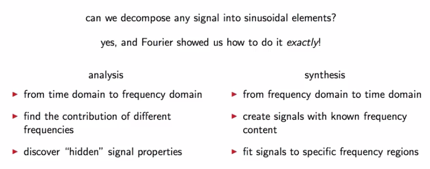

### 3.1.b The DFT as a change of basis

We will start with a finite-length signals (i.e. vectors in $\mathbb{C}^N$)  It turns out that in the space of finite-length signals, the Fourier analysis is just a simple change of basis. To illustrate this, let's see a temporal signal, where we do not notice anything special.

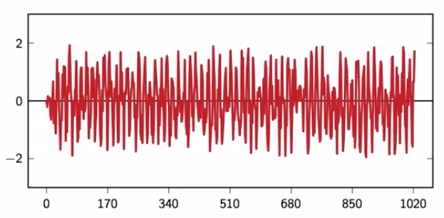

And the same signal in the frequency domain with a proper change of Fourier basis.

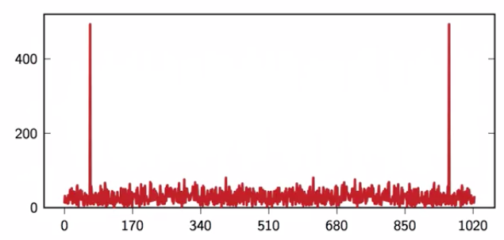

The Fourier basis for $\mathbb{C}^N $ will require $N$ different vectors each of which will have length $N$. So $k$ will be the index that indicates different vector, $n$ will be the index of each vector. We claim that this constitutes a set of orthogonal vectors in $\mathbb{C}^N $ .

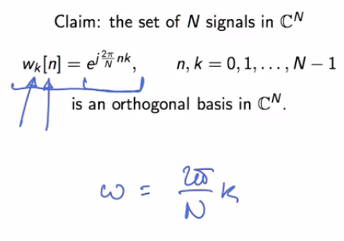

We can express the signals in vector notation, remember our notation we use bold letter for vectors

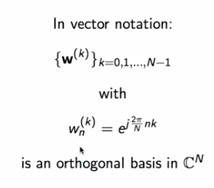

We can quickly get a feeling for what these vectors look like if we remember the complex exponential generating machine from the last chapter :

* For the first vector $k=1$ (an the blue one are the second vector, $k=2$)

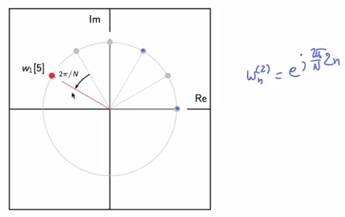

**Examples :**

----

Let's see a concrete example, with $N=64​$, we look at the real and imaginary part of the vector when the vector rotate around the circle; the point will complete one full revolution over 64 points, basis vector $\mathcal{w}^{(1)} \in \mathbb{C}^{64}​$

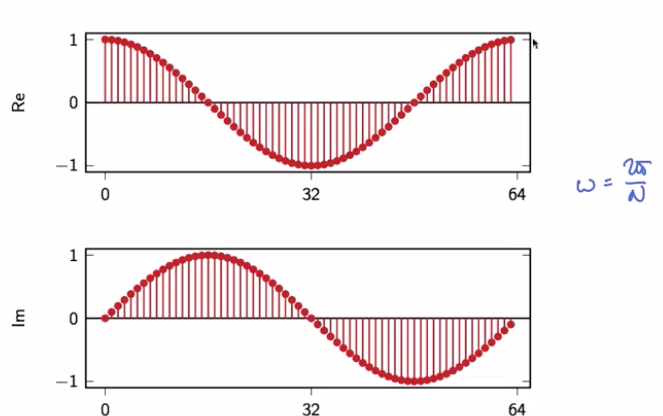

the second 16th basis vector $\mathcal{w}^{(16)} \in \mathbb{C}^{64}​$, we only have four points because the angle is 

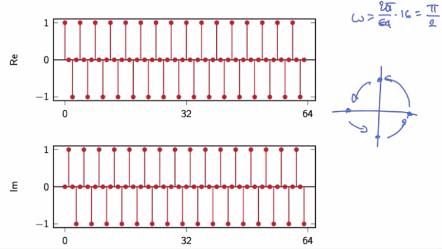

the bigger the N the more it is difficult to image a sinusoide, but even at 16 we still have a sinusoids

add many images $\mathcal{w}^{(20)} \in \mathbb{C}^{64}​$

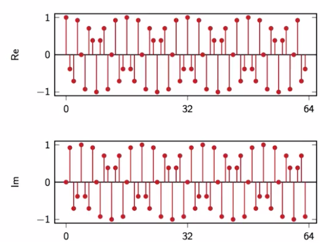

**Orthogonality and proof :**

-----

We just showed a very beautiful family of little vectors, but in order for these vectors to be a basis of CN, we have to prove that they are orthogonal to each other. Orthogonality requires that the inner product between any two vectors of the family is zero.

On the numerator of the last equation the value will always be zero because we are on the right of the plot.

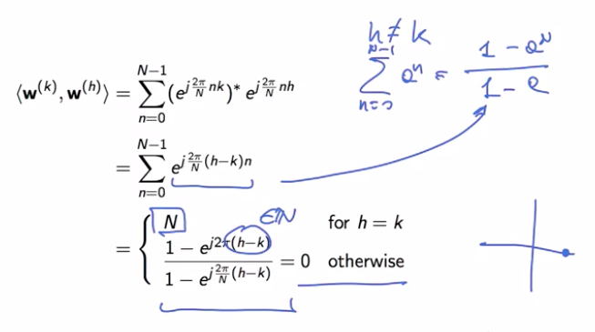

So the vector are orthogonal so we can define a basis in $\mathbb{C}^{N}$. Vectors are not orthonormal though, **we have to add a normalization factor** $1 / \sqrt{N}$ .

## 3.2 The Discrete Fourier transform

### 3.2.a DFT definition

We recall what we just saw :

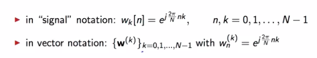

And that we now have a orthonormal basis once we add the normalization factor :

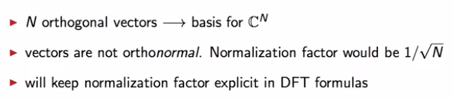

In the first one, we want to express $x$ in this new fourier basis. In the synthesis formula we had the normalization vector $1 / N$.

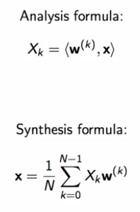

To stress that it is just a linear algebra problem, we can construct the big matrix, where we simply put the conjugate value of each vector :

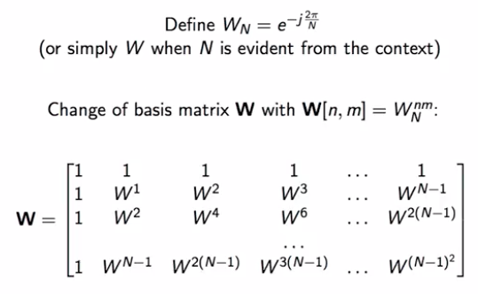

With this notation, we will get a vector notation: (the $H​$ is the hermitian)

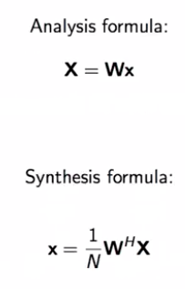

A third way of looking at Fourier discrete transform is to consider explicitly the operations involved in the transformation. In this case, we will consider signals explicitly and this is a notation that is particularly useful if we want to consider the algorithmic nature of the transform

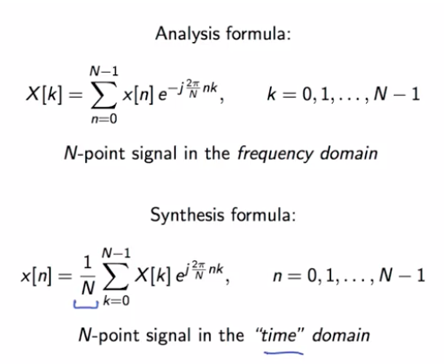

Maybe this is a good point to remind you that, although we talked about time domain, in the discrete time world, time is really adimensional. So it won't be time in the sense of seconds or any other physical unit of measure it will be just an index that moves over the range of integers.

### 3.2.b Examples of DFT calculation

**Example - DFT of** $\mathbb{x} [n] = 3 cos(2 \pi / 16 n), ~~\mathbb{x}[n] \in \mathbb{C}^{{64}}​$

---

$$
\begin{align}
\mathbb{x} [n] &= 3~ cos(\frac{2 \pi}{16}  n) \\
&= 3~ cos(\frac{2 \pi}{64}4 n) \\
 Cosine~formula:& ~ cos ~ \omega  = \frac{e^{j \omega} + e^{-j \omega}}{2}\\
&= 3/2 \Big[e^{j \frac{2 \pi}{64}4n} + e^{-j \frac{2 \pi}{64}4n}    \Big] \\
&= 3/2 \Big[e^{j \frac{2 \pi}{64}4n} + e^{j \frac{2 \pi}{64}60n}    \Big] \\
& = \frac{3}{2} ( \mathbb{w}_4 [n] + \mathbb{w}_{60} [n])

\end{align}
$$

We know that the two inner product will be 1 only if $k=4$ or $k=60$ ; if $k=4$ it the inner product will be equal to $N=64$ same for $k=60$. Then by doing the arithmic we get $96$ in the two cases
$$
\begin{align}
X[k] &= \langle w_k[n], \mathbb{x}[n]  \rangle \\
&= \langle w_k[n],  \frac{3}{2} ( \mathbb{w}_4 [n] + \mathbb{w}_{60} [n])  \rangle \\
&=  \frac{3}{2}\langle \mathbb{w}_k [n], \mathbb{w}_{4}[n]\rangle + \frac{3}{2}\langle \mathbb{w}_k [n], \mathbb{w}_{60}[n] \rangle \\
&=  \left \{
\begin{array}{c @{=} c}
    96 & for~ k=4, ~60 \\
    0 & otherwise \\
\end{array}
\right.

\end{align}
$$
We can plot it, and see that on the real part it will be 0 everywhere except in 4 and 60

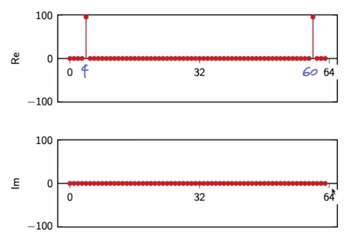

**Example - DFT of** $\mathbb{x} [n] = 3 cos(2 \pi / 16 n + \pi/3), ~~\mathbb{x}[n] \in \mathbb{C}^{{64}}$

----

We compute with exact same method as before

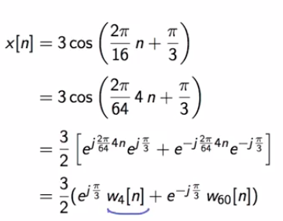

We can get those values:

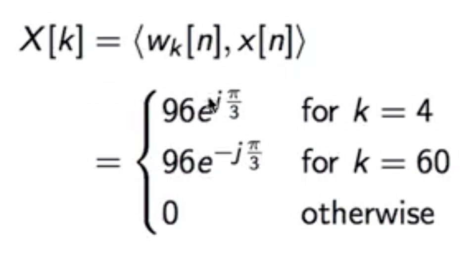

We can plot the Fourier transform

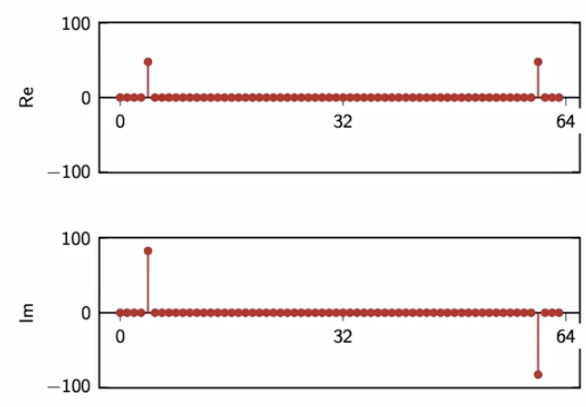

A clearer way is to plot the magnitude and the phase of the fourier coefficients, this way of plotting the data  shows that we can use the Fourier transform to separate the amplitude of a sinusoide from its phase.

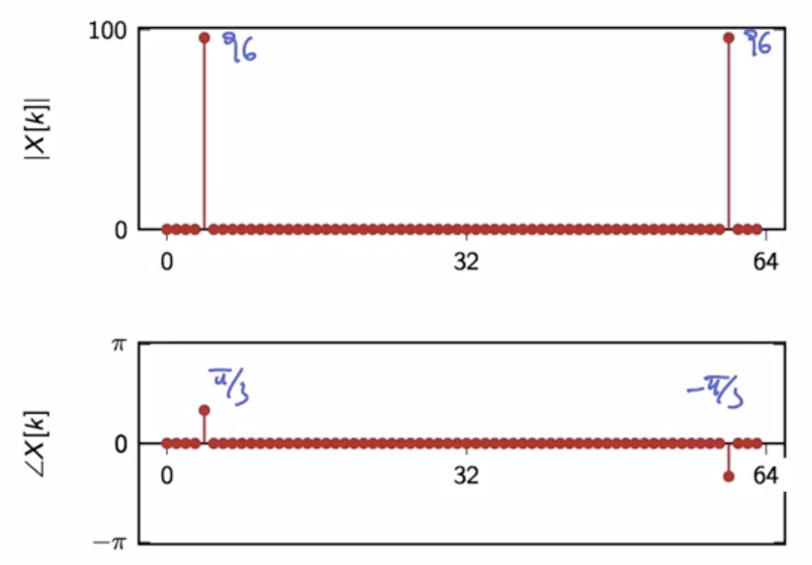

7:27

### 3.2.c Interpreting a DFT plot

As we've seen some examples, we can give some general guidelines on how to interpret a DFT plot.

we can give some general guidelines on how to interpret a DFT plot. So first of all, you will have frequency coefficients from zero to big N minus one where N is the size of your vector space. 

* The first N over two coefficients correspond to frequencies less than pi. So we're talking about **counter-clockwise movement** of the point on the complex plane.

* Frequencies from $N/ 2$ to $N-1$, are frequencies  larger than $\pi$ and we interpret those as **clockwise rotations in the plane.**
* Frequencies in this band, close to zero and close to N minus 1 are low frequencies, in the sense that they are indicate a slow rotation around a unit circle, either counterclockwise or clockwise here.
* Whereas frequencies centered around N over 2 correspond to the fastest frequencies in the vector space, either clockwise or counterclockwise.

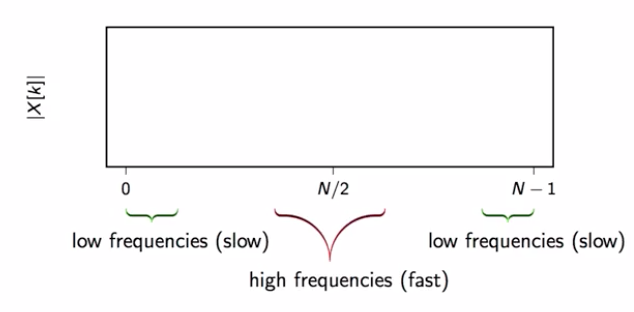

**Example 1 - Slowest signal :**

* So, if we go back to the examples that we saw before, if we take x of n, the units signal, so equal to one for all points, well this is the slowest possible signal in the sense that it never really changes, it remains constant for the whole duration of its life. And correspondingly, it's Fourier transform only contains the lowest frequency coefficient. It's not even a frequency in a sense, because k equal to zero is absence of movement. 

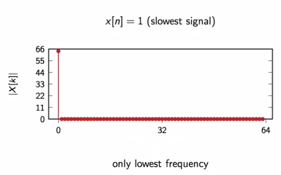

**Example 2 - Fastest signal :**

* It is the fastest signal in this period of time, it's DFT would only have one known zero coefficient exactly at the highest frequency point.

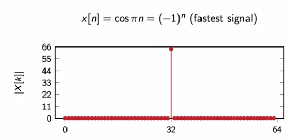

**Energy distribution :**

* Now if you recall Parseval's theorem from module 3.3, we know that the energy of a signal will not change if we change the underlying basis, so conservation of energy across domains. 

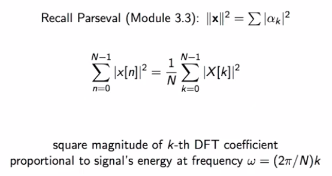

Examples:

* We can see that the energy is located only on the low frequencies

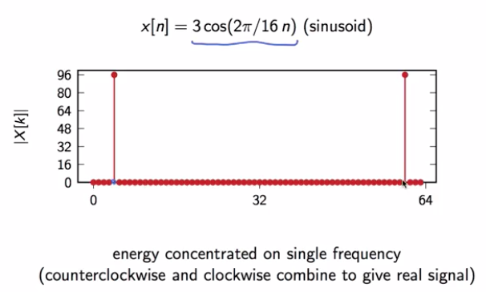

* The energy is especially located on the low frequencies but also around the fast at the lower amplitude

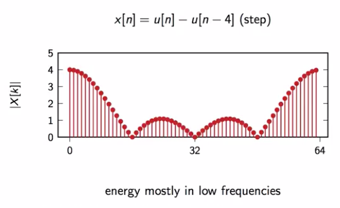

**DFT of real signals :**

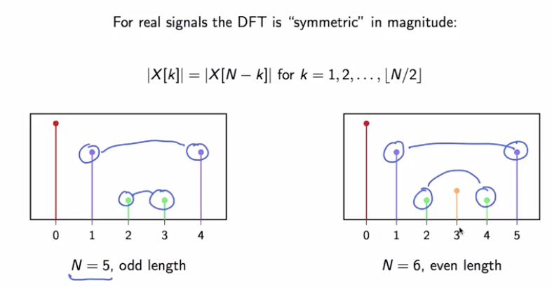

For real valued signal, the magnitude of **the DFT is completely specified by only the floor of N over 2 plus 1 coefficients.** So for N equal to 5, for instance, we only need three coefficients.

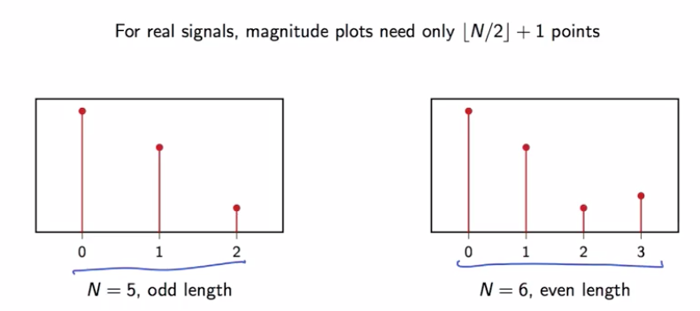

## 3.3 The DFT in Practice

### 3.3.a A DFT analysis

We take back our previous signal, and we're can now analyze it

We take the DFT, we see the spikes arrive only in the real part, so we remember that the peaks are going to be a cosine

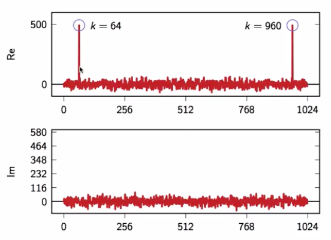

We can write our signal as such with eta, the noise component

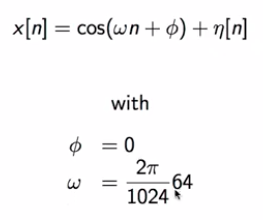

If we plot the two graph we have : 

* **a cosine **that oscillates 64 times in 1024 points 
*  we have an **additional noise component** that doesn't really seem to have any structure.

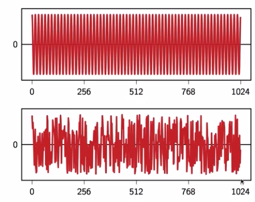

## 3.4 The Short-Time Fourier transform

### 